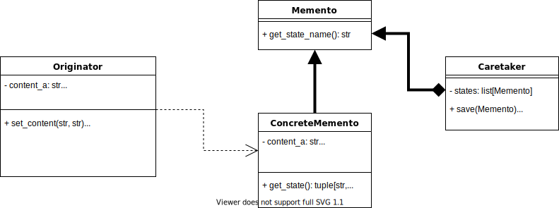

## Memento pattern

The memento pattern provides the ability to restore an object to its previous state, that is undo via rollback.



### Output of command: python main.py:
```
Creating originator with content_a = a, content_b = b
Created originator with content ('a', 'b')
Creating originator state with content_a = a, content_b = b
Saving originator state with name = TYfBismaHw
Setting originator content_a = a2, content_b = b2
Originator content: ('a2', 'b2')
Creating originator state with content_a = a2, content_b = b2
Saving originator state with name = pCMGYavtqR
Setting originator content_a = a3, content_b = b3
Originator content: ('a3', 'b3')
Loading previous originator state
Restoring originator state with name = pCMGYavtqR
Originator content: ('a2', 'b2')
Loading previous originator state
Restoring originator state with name = TYfBismaHw
Originator content: ('a', 'b')
Loading previous originator state
Originator is in initial state
Originator content: ('a', 'b')
```